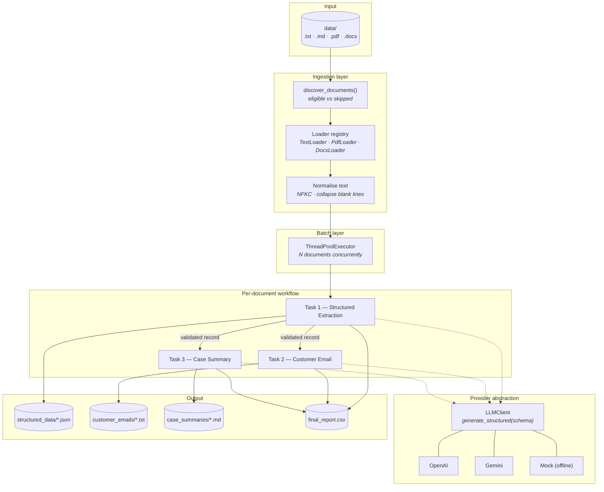
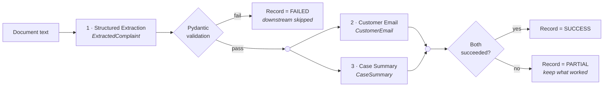
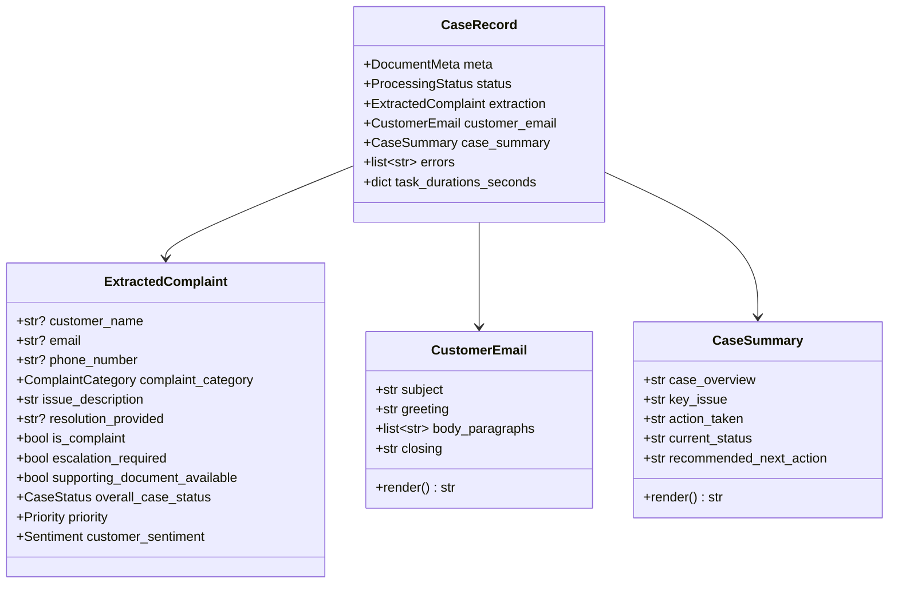

# Architecture

## 1. System overview



## 2. Per-document task graph

Step 1 is a hard dependency. Steps 2 and 3 depend on step 1 but not on each
other, so by default they run concurrently.



## 3. Layer responsibilities

| Layer | Module | Responsibility | Depends on |
| --- | --- | --- | --- |
| Entry | `run.py`, `cli.py` | Parse flags, build settings, set exit code | config, batch |
| Config | `config.py` | Environment-driven settings, derived paths | — |
| Ingestion | `ingestion/loaders.py` | File discovery, format dispatch, text extraction | — |
| Prompts | `prompts/*.py` | System and user prompt construction | — |
| Provider | `llm/*.py` | Structured generation, retries, usage accounting | models |
| Tasks | `tasks/*.py` | One LLM step each | llm, prompts, models |
| Workflow | `workflow.py` | Per-document orchestration, failure policy | tasks |
| Batch | `batch.py` | Concurrency across documents | workflow, ingestion |
| Persistence | `persistence.py` | Per-case files on disk | models, config |
| Reporting | `reporting.py` | CSV, manifest, console summary | models |

Dependencies point in one direction only — entry → batch → workflow → tasks →
provider/prompts → models. No module imports from a layer above it, and nothing
outside `llm/` imports a vendor SDK.

## 4. Data model



## 5. Concurrency model

Two independent levels, both thread-based because every task is a network-bound
HTTP call that releases the GIL while it waits:

```
Batch level      ThreadPoolExecutor(max_workers = BATCH_WORKERS)
                 └── document 1 ──┐
                     document 2 ──┼── independent, no shared mutable state
                     document N ──┘

Document level   ThreadPoolExecutor(max_workers = 2)
                 └── extraction ──▶ [ email ‖ summary ]
```

The batch pool is bounded rather than one-thread-per-file so that a folder of
500 documents does not open 500 connections and trip provider rate limits. The
only shared mutable state is the client's token counter, which is guarded by a
lock.

## 6. Failure policy

| Failure | Effect | Rationale |
| --- | --- | --- |
| Unsupported extension | Reported as a skipped file | Visible, not silently dropped |
| Unreadable / empty file | `FAILED` row in the report | A bad file must not abort the batch |
| Extraction fails | `FAILED`, downstream skipped | Both downstream tasks need its output |
| Email or summary fails | `PARTIAL`, other outputs kept | Don't discard good work |
| Provider timeout / 429 | Retried with exponential backoff | Transient by nature |
| Missing API key | Fatal, before the batch starts | Fail fast with actionable guidance |

Exit codes: `0` all succeeded · `1` some partial/failed · `2` configuration
error · `3` fatal.

## 7. Key design decisions

**Three prompts, not one.** A single prompt returning all three artefacts would
be cheaper, but it degrades on long documents, makes validation coarse (one bad
field fails everything), and prevents parallelism. Splitting the tasks keeps each
prompt short and focused and lets the email and summary run concurrently.

**Downstream tasks read the validated extraction, not the raw document.** By the
time the email is written, placeholders are `None` and malformed contact details
have been dropped, so a hallucinated email address cannot reach a customer-facing
artefact. The original document is still passed as read-only context for tone.

**Native structured outputs over prompt-and-parse.** Both providers accept a
Pydantic model as a response schema and return a validated object. This removes
the entire class of JSON-in-markdown-fences parsing bugs.

**No defaults on LLM-facing schemas.** OpenAI's strict mode requires every
property to be required, so optional values are `T | None` instead. A test
asserts this so the constraint cannot be broken accidentally.

**A provider abstraction with an offline implementation.** `LLMClient` has three
implementations; the offline one is rule-based and deterministic, which makes the
whole pipeline demonstrable with no API key and gives the test suite a real
backend to run against.
